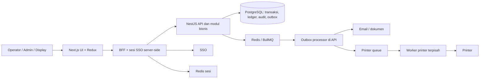

# Audit Enterprise Architecture ANSEI

Tanggal: 19 September 2026. Baseline checkout: `954d190`, versi aplikasi `1.32.1`.

## Kesimpulan eksekutif

ANSEI memiliki fondasi yang layak dikembangkan menjadi aplikasi operasional jangka panjang. Struktur domain NestJS, PostgreSQL, ledger, transaksi, SSO melalui BFF, transactional outbox, worker printer, dan CI sudah tersedia. Investasi berikutnya sebaiknya berfokus pada integritas lintas proses, riwayat keputusan bisnis, dan kemampuan pemulihan.

Penilaian arsitektural: **layak dilanjutkan dengan penguatan bertahap; kesiapan enterprise dan traceability end-to-end belum terbukti**. Ini bukan sertifikasi produksi atau hasil penetration test. Pengamatan menunjukkan aplikasi lebih siap melacak kuantitas dan dokumen dibanding membuktikan genealogy material: lot mana dikonsumsi untuk box mana dan terkirim kepada siapa.

Prioritas keputusan:

1. Tutup celah retry transaksi, perubahan BOM aktif, audit aksi administratif, dan status pekerjaan asinkron.
2. Tetapkan tingkat traceability yang dibutuhkan: per part, lot, box, atau serial; kebutuhan recall menentukan model datanya.
3. Pertahankan modular monolith sebagai arah evolusi awal, dengan kepemilikan domain dan kontrak yang tegas.
4. Buktikan ketahanan melalui pengujian database/queue nyata dan latihan restore sebelum memperluas penggunaan.

## Ruang lingkup dan tingkat kepastian

Audit membaca struktur aplikasi, schema dan migrasi, bootstrap API, autentikasi, BFF, transaksi inventory, BOM, produksi, outbox, printer, rekonsiliasi, health checks, dan CI. Audit juga menjalankan tujuh suite unit yang relevan. Pemeriksaan ini merupakan sampling arsitektur, bukan pemeriksaan setiap endpoint.

- **Teramati:** struktur, kode, dan konfigurasi yang ada di checkout.
- **Risiko turunan:** konsekuensi yang dapat terjadi dari jalur kode; belum direproduksi dengan infrastruktur nyata.
- **Belum terbukti:** keadaan deployment, konfigurasi eksternal, data historis, kapasitas, backup, dan kontrol organisasi.

File tidak terlacak yang sudah ada sebelum audit dipertahankan. Tidak ada perubahan source aplikasi, schema, migrasi, dependency, atau data.

## Peta arsitektur saat ini



Executable code lebih baru daripada sebagian dokumentasi: workspace juga mempunyai `apps/printer`; frontend menggunakan SDK SSO; API sudah mendaftarkan `ResponseTransformInterceptor`. Skill `ansei-api-response` masih menyatakan tidak ada interceptor sukses global. Perbedaan ini merupakan temuan governance karena dapat mengarahkan implementasi berikutnya ke kontrak yang salah.

## Fondasi yang sudah baik

| Area | Bukti aktual | Nilai jangka panjang |
|---|---|---|
| Domain aplikasi | Modul master, warehouse, production, reporting, settings di `apps/api/src/app.module.ts` | Titik awal batas tanggung jawab sudah jelas |
| Konsistensi stok | Ledger, helper transaksi Serializable, serta SQL CHECK dan unique index | Pengamanan tersedia di aplikasi dan database |
| Rekonsiliasi | `apps/api/src/report/inventory-reconciliation.service.ts` | Sudah mendeteksi chain break, cache mismatch, duplikasi hasil produksi, dan inkonsistensi release |
| Integrasi asinkron | Outbox tersimpan di transaksi DB, retry, pemulihan stale event | Kegagalan queue tidak langsung menghilangkan niat bisnis |
| Identitas | BFF memakai SSO, token server-side, API key di-hash, guard global | Trust boundary lebih terpusat |
| Produksi | Relasi label, assembly session, operator, Poka-Yoke, delivery; request ID unik untuk assembly | Sebagian genealogy barang jadi dan anti-duplikasi sudah terbentuk |
| Delivery engineering | CI lint/test/build, container non-root, peran runtime API/web/printer | Dasar release yang dapat direproduksi |

Keberadaan migrasi dalam repository belum membuktikan migrasi tersebut telah diterapkan pada database produksi.

## Temuan prioritas

Prioritas **P1**: risiko integritas, audit, atau operasi yang perlu ditutup lebih awal. **P2**: penguatan sebelum pertumbuhan volume, variasi proses, dan perluasan lokasi. Urutan tidak menyatakan adanya insiden produksi.

### EA-01 — P1: Traceability material belum sampai ke genealogy lot

**Bukti:** `apps/api/prisma/schema.prisma:211`, `:308`, `:425`, `:479`, `:522`, `:551`, `:589`. Ledger mencatat part, kategori, jenis lokasi dan referensi dokumen. IncomingMaterial serta Shopping belum membawa identitas lot material yang dapat dihubungkan ke konsumsi box. ProductionReport memiliki kolom tanggal komponen seperti LatchDate/CableHDate, tetapi bukan relasi lot terstruktur.

**Dampak:** aplikasi dapat menunjukkan mutasi suatu part dan aktivitas label; dari model yang diperiksa belum dapat membuktikan secara presisi semua box yang menggunakan lot supplier tertentu. Recall berpotensi harus memakai cakupan lebih luas.

**Arah:** rancang lot penerimaan, alokasi/pemakaian lot, output lot/box, serta hubungan konsumsi ke produksi. Perlakukan split, merge, scrap, return dan rework sebagai kejadian eksplisit. Simpan juga status quality/hold bila dibutuhkan bisnis.

**Kriteria selesai:** pilih satu lot dan temukan seluruh output serta pengirimannya; pilih satu box dan temukan lot asal, operator, proses, inspeksi, serta revisi BOM yang dipakai. Data lama tanpa bukti harus ditandai unknown, bukan diisi perkiraan seolah pasti.

### EA-02 — P1: BOM belum berversi dan dapat mengubah dasar validasi produksi berjalan

**Bukti:** schema `:172` menyimpan pasangan material–finish good dan Qty tanpa revisi/effective date. `apps/api/src/master/bill-of-materials/bill-of-materials.service.ts:278` memperbarui baris langsung. `apps/api/src/common/helpers/production-flow.helper.ts:48` membaca BOM saat ini untuk menentukan kelengkapan shopping sebelum scan/delivery.

**Skenario:** release dibuat dengan kebutuhan material 1 unit per produk, lalu BOM master diubah menjadi 2. Pemeriksaan berikutnya menghitung kebutuhan memakai nilai 2, walaupun order dimulai dengan aturan sebelumnya.

**Arah:** gunakan BOM revision dengan approval dan masa berlaku, kemudian ikat release ke snapshot/revisi tertentu. Perubahan order aktif perlu keputusan amendment eksplisit. Pengamanan awal dapat membatasi perubahan BOM yang sedang dipakai proses aktif.

**Kriteria selesai:** perubahan master tidak mengubah interpretasi order historis maupun kebutuhan order aktif tanpa amendment yang diaudit.

### EA-03 — P1: Transfer belum idempotent pada retry pengguna

**Bukti:** `apps/api/src/warehouse/transfer/transfer.service.ts:84` menghasilkan referensi UUID baru setiap pemanggilan. Controller dan DTO menerima part serta qty tanpa identitas perintah yang persisten. Transaksi dan dua ledger entry memang atomik.

**Skenario:** commit transfer berhasil tetapi respons terputus; pengguna mengulang permintaan yang sama dan sistem melakukan transfer kedua jika saldo masih mencukupi. Lock mencegah benturan transaksi, tetapi tidak mengenali pengulangan niat yang sama.

**Arah:** identitas perintah dari pemanggil, fingerprint payload, dan penyimpanan hasil dalam transaksi yang sama. Scope key harus jelas; key sama dengan payload berbeda menghasilkan konflik. DTO juga baru menggunakan `IsNumber`, belum menegaskan integer positif sesuai kuantitas inventory.

**Kriteria selesai:** dua kiriman identik, termasuk setelah timeout pasca-commit, menghasilkan satu transfer dan dua ledger entry saja. Nol, negatif dan pecahan ditolak sebelum menyentuh persistence.

### EA-04 — P1: Audit administratif dan korelasi lintas sistem belum utuh

**Bukti:** `schema.prisma:632` menyimpan proses dan pesan, tanpa hubungan terstruktur ke request, entity version, reason dan perubahan before/after. `apps/api/src/user-management/api-key/api-key.controller.ts:68` dan service `:161` melakukan revoke tanpa meneruskan pelaku; reactivate/delete mempunyai pola serupa. Tidak ada LogProcessService pada service API key. Middleware API menghasilkan request ID, tetapi BFF hanya menyalin content-type/accept dan model outbox tidak menyimpan trace context.

**Dampak:** sulit membuktikan siapa mencabut/mengaktifkan akses serta menghubungkan tindakan browser, proses bisnis, ledger, outbox, dan printer dalam satu investigasi.

**Arah:** audit event terstruktur dengan actor stabil, action, entity ID, perubahan yang diizinkan untuk diaudit, alasan, timestamp, correlation ID dan causation ID. Rekam event bisnis yang sukses atomik dengan mutasi. Kegagalan dapat masuk kanal diagnostik terpisah. Propagasikan context melewati BFF, API dan queue; W3C mendefinisikan `traceparent`/`tracestate` untuk konteks distributed tracing: [W3C Trace Context](https://www.w3.org/TR/trace-context/).

**Kriteria selesai:** satu ID investigasi menghubungkan seluruh hop; seluruh aksi administratif kritis mencatat pelaku dan alasan. Jangan menyalin token atau payload sensitif penuh ke audit.

### EA-05 — P1: Outbox mempunyai celah urutan dispatch dan arti status sukses

**Bukti:** `apps/api/src/common/outbox/outbox.dispatcher.ts:72` menambahkan job sebelum mengubah event menjadi QUEUED. Processor `outbox.processor.ts:68` hanya mengambil event QUEUED. Untuk printing, processor menandai event SUCCEEDED setelah memasukkan job ke printer queue (`:114`), belum menunggu hasil worker printer.

**Risiko turunan:** worker cepat dapat melihat event masih PENDING lalu keluar tanpa memproses; event selanjutnya bisa menunggu pemulihan stale sekitar 10 menit. Status SUCCEEDED membuktikan handoff print, bukan cetak berhasil. Email juga bisa terkirim dua kali jika provider menerima pesan tetapi pencatatan hasil DB gagal.

**Arah:** desain state machine claim/publish/consume yang tahan seluruh urutan interleaving. Pisahkan status dispatched, processing, succeeded, failed, dan outcome unknown bila efek eksternal tidak dapat dipastikan. Retry operator harus menghormati pekerjaan yang masih berjalan. Samakan batas Attempts dengan MaxAttempts; dispatcher saat ini memakai angka 5, sedangkan processor menghitung exhausted menggunakan Attempts yang sudah dinaikkan ditambah satu lagi.

**Kriteria selesai:** uji worker lebih cepat dari update DB, crash setelah publish, crash setelah side effect, beberapa replica, dan retry operator. Untuk cetak, simpan hasil worker dan bedakan penerimaan spooler dari bukti fisik cetak. Prinsip retry harus mempertahankan hasil akhir yang sama: [BullMQ idempotent jobs](https://docs.bullmq.io/patterns/idempotent-jobs).

### EA-06 — P1: Jaminan historis ledger masih perlu diperkuat

**Bukti:** SQL migrasi `20260917170000_inventory_ledger_integrity` memeriksa aritmetika, kategori/lokasi dan duplikasi hasil produksi. Tidak ditemukan pengaturan append-only ledger/audit dalam migrasi yang diperiksa. Transfer membaca BalanceBefore dari cache Material, sedangkan assembly menghitung agregat ledger. Rekonsiliasi mengurutkan histori berdasarkan TransactionDate lalu UUID Id.

**Dampak:** bila cache menyimpang, transfer dapat melanjutkan chain dari saldo cache yang salah. Baris bertimestamp sama tidak memiliki sequence bisnis yang pasti; urutan UUID tidak menyatakan urutan posting. CHECK per baris juga tidak membuktikan continuity seluruh chain.

**Arah:** tetapkan satu protokol posting stok: sumber saldo konsisten, versi/sequence per stock key, audit dan cache atomik, larangan modifikasi history oleh role runtime, dan reversal yang merujuk transaksi asli. Reconciliation perlu snapshot konsisten atau watermark karena query paralel saat ini dapat melihat momen data berbeda.

**Kriteria selesai:** koreksi stok membuat reversal/adjustment baru; chain dan cache tetap konsisten saat transaksi konkuren. Hak DBA dan pengecualian maintenance diatur terpisah. Belum ada bukti manipulasi data aktual.

### EA-07 — P2: Struktur lokasi dan proses masih membatasi ekspansi

**Bukti:** LocationType hanya WAREHOUSE/RACK/FINISH_GOOD_AREA (`schema.prisma:18`), RackLocation adalah string pada Material, dan stock cache terbagi QtyWarehouse/QtyRack. Unique index `ProductionRelease_one_released_key` membatasi satu release RELEASED untuk seluruh tabel. ProductionReport menanamkan nama komponen sebagai kolom tetap.

**Dampak:** penambahan gudang fisik, line paralel, proses produk baru, atau parameter inspeksi dapat memerlukan perubahan schema/kode. Aturan satu release mungkin tepat untuk operasi sekarang, tetapi belum cocok untuk multi-line independen.

**Arah:** setelah kebutuhan dikonfirmasi, modelkan site/warehouse/bin dan production line sebagai identitas; scope release serta lock sesuai lingkup operasional. Gunakan parameter proses bertipe, berversi, bervalidasi dan disetujui. Field kritis relasional harus tetap mempunyai constraint; hindari memindahkan seluruh domain ke JSON tanpa aturan.

**Kriteria selesai:** konfigurasi satu line/lokasi atau revisi formulir yang didukung tidak mengubah histori dan tidak memerlukan perubahan logic inti.

### EA-08 — P2: Ownership domain belum ditegakkan secara struktural

**Bukti:** PrismaService global (`apps/api/src/prisma/prisma.module.ts`) dapat diakses semua modul. Beberapa service memadukan orkestrasi/persistence/reporting dalam file besar: inventory-counting 3.259 baris; production-release 2.010; material-delivery-note 1.578; shopping 1.341 pada checkout audit.

**Dampak:** perubahan satu domain berpotensi memengaruhi invariants domain lain; developer harus memahami terlalu banyak detail sebelum melakukan perubahan aman. Jumlah baris sendiri bukan bukti cacat.

**Arah:** tetapkan pemilik write untuk Inventory, Production, Warehouse, Master Data dan Identity. Pisahkan use case, kebijakan bisnis, rendering dokumen, dan read model secara bertahap. Tambahkan aturan dependency/import serta contract tests. Reporting boleh mempunyai read model lintas domain dengan ownership yang jelas.

**Kriteria selesai:** stok hanya berubah melalui API internal posting inventory yang disepakati; business modules tidak menyalin aturan saldo masing-masing.

### EA-09 — P2: Skalabilitas perlu diukur sebelum memperkecil lock

**Bukti:** `inventory-transaction.helper.ts:11` memakai dua lock tingkat kategori; `production-flow.helper.ts:5` memakai satu global production lock. Keduanya menjaga konsistensi tetapi membuat transaksi yang mengikuti lock tersebut antre pada lingkup luas. Tidak semua jalur menggunakan protokol sama: assembly juga memakai row lock dan shopping memiliki lock forecast.

**Arah:** ukur waktu tunggu lock, p95 transaksi, contention, deadlock dan jumlah retry. Setelah protokol integritas seragam dan teruji, pertimbangkan lock per item/lokasi atau aggregate dengan urutan acquisition yang konsisten. Jangan menghapus lock hanya untuk mengejar throughput.

**Kriteria selesai:** beban puncak yang disepakati memenuhi latensi dan zero duplicate/negative-stock invariants. Tidak ada angka kapasitas yang dapat disimpulkan dari audit statis ini.

### EA-10 — P1/P2: Quality gate belum membuktikan alur enterprise secara nyata

**Bukti:** `.github/workflows/ci-and-publish.yml` menjalankan unit test API/printer serta lint/build; belum menjalankan suite integrasi database/queue dan perjalanan browser. `apps/api/test/warehouse/transfer.e2e-spec.ts` mengimpor guard/strategy JWT yang sudah tidak ada. Skrip test web tidak ditemukan di package web.

**Dampak:** CI dapat lulus meski regresi ada pada transaksi paralel, SSO→BFF→API, migrasi SQL, atau recovery queue. Tujuh suite yang dijalankan dalam audit menggunakan mock, bukan database nyata.

**Arah:** P1 untuk skenario integritas kritis; P2 untuk memperluas cakupan. Jalankan ephemeral PostgreSQL/Redis, fresh migration dan upgrade migration, isolation/retry tests, contract tests dan browser smoke test. Sesuaikan harness autentikasi E2E dengan implementasi sekarang.

**Kriteria selesai:** CI gagal pada duplicate command, concurrent stock race, perubahan BOM historis, permission denial dan skenario crash outbox. Gunakan dataset sintetik dan database disposable.

### EA-11 — P1/P2: Recovery dan observability operasional belum terbukti

**Bukti:** health service memiliki liveness/readiness. Redis dinilai melalui TCP; status printer dari konfigurasi, bukan keberhasilan job. Compose contoh menyediakan volume, tetapi tidak menunjukkan proses backup/restore. Tidak ditemukan runbook RPO/RTO dan latihan recovery dalam direktori docs/CI yang diperiksa. Kontrol eksternal bisa saja sudah tersedia.

**Arah:** verifikasi backup PostgreSQL beserta arsip WAL, dokumen/attachment, konfigurasi dan artefak release. Uji restore di lingkungan terisolasi dan rekonsiliasi sesudahnya. PostgreSQL mendukung pemulihan titik waktu melalui base backup dan WAL: [PostgreSQL 16 PITR](https://www.postgresql.org/docs/16/continuous-archiving.html). Definisikan RPO sebagai kehilangan data maksimum yang dapat diterima dan RTO sebagai durasi pemulihan maksimum, disetujui owner operasi.

**Kriteria selesai:** sebelum memperluas produksi, tersedia hasil restore bertanggal dan pengukuran RPO/RTO. Dashboard memantau umur outbox tertua, failed jobs, ledger mismatch, dependency failure dan lock wait; alert mempunyai owner dan prosedur tindak lanjut.

### EA-12 — P2: Governance kontrak, akses dan dokumentasi perlu dirapikan

**Bukti:** skill response tertinggal dari interceptor aktif; `apps/api/pnpm-lock.yaml` masih terlacak meskipun aturan workspace menyebut satu root lockfile. Guard mengizinkan user terautentikasi ketika metadata permission tidak ada. API key mempunyai hash dan status aktif tetapi belum mempunyai expiry/scope per key dalam schema. PrinterProcessor menulis metadata PO/part/qty pada log diagnostik.

**Arah:** gunakan checklist route untuk menyatakan public/authenticated/permission secara eksplisit, tinjau least privilege serta separation of duties untuk approval/adjustment, dan lifecycle service credential. Tambahkan ownership dokumentasi kontrak, decision record (ADR), kebijakan deprecation, dan satu jalur dependency management. Kurangi log operasional sensitif; atur akses dan retensinya sesuai klasifikasi data.

**Kriteria selesai:** setiap endpoint mempunyai kebijakan akses yang dapat diuji; perubahan kontrak memperbarui dokumentasi dan consumer tests; kredensial mempunyai owner dan jadwal review/rotasi. Temuan ini tidak menyatakan ada endpoint yang telah terbukti dapat dieksploitasi.

## Target arsitektur jangka panjang

Rekomendasi berdasarkan kondisi kode: gunakan **modular monolith dengan worker terpisah**, satu otoritas inventory dan kontrak domain eksplisit. Pemecahan service dapat diputuskan kemudian berdasarkan kebutuhan deploy, ownership tim, isolasi kegagalan, atau beban yang sudah diukur.

| Domain | Tanggung jawab utama | Kontrak yang harus stabil |
|---|---|---|
| Master Data | Part, supplier, UOM, BOM/revisi, parameter proses | Identitas stabil, versi berlaku, approval |
| Warehouse | Receiving, putaway, pick, transfer, shipping | Identitas perintah, lot, lokasi, referensi dokumen |
| Inventory | Posting, balance, reservation jika dibutuhkan, reversal, reconciliation | Atomic ledger/cache/audit dan idempotency |
| Production | Release, work execution, assembly, material consumption, output | Snapshot BOM/routing, transisi status, genealogy |
| Quality | Inspection, hold/release, NG, rework | Hasil bertipe, alasan, operator dan revisi standar |
| Integration | Outbox, printer, email, sistem eksternal | Event version, delivery status, retry dan deduplication |
| Audit/Reporting | Timeline bisnis dan read models | Correlation, watermark, lineage, retention |
| Identity | User/service identity dan authorization | Permission, scope, lifecycle credential |

Quality/reservation/routing di tabel adalah usulan kemampuan target, bukan klaim bahwa model tersebut sudah tersedia. Penerapannya memerlukan keputusan bisnis dan perubahan schema yang terencana.

Dinamis harus berarti **konfigurasi yang dibatasi, berversi, disetujui, dan dapat diuji**. Setiap transaksi perlu tetap menjawab: aturan versi berapa yang berlaku saat keputusan dibuat? Hindari perubahan konfigurasi yang diam-diam menafsirkan ulang histori.

## Roadmap yang disarankan

Rentang berikut adalah urutan perencanaan, bukan estimasi komitmen tanpa mengetahui kapasitas tim.

| Fase | Fokus | Hasil yang dapat diterima | Owner yang disarankan |
|---|---|---|---|
| 0–30 hari | Integritas dan baseline operasi | Retry transfer aman; guard perubahan BOM aktif; actor audit API key; outbox race/status diperbaiki; inventaris backup dan target RPO/RTO; integration tests kritis | Tech lead, backend, QA, operasi TI |
| 31–60 hari | Traceability pilot | BOM revision/snapshot; correlation lintas hop; audit terstruktur; pilot lot-to-box pada satu alur produk; restore berhasil | Arsitek, produksi, quality, warehouse, DBA |
| 61–90 hari | Fleksibilitas dan ownership | Scope lokasi/line disepakati; posting inventory dipusatkan bertahap; contract/browser tests; runbook alert dan retry | Domain owners, frontend/backend, QA, operasi |
| 3–6 bulan | Skala dan adopsi | Genealogy diperluas; quality/rework sesuai kebutuhan; read model laporan; load test; evaluasi partition/archiving dari data aktual | Product owner, quality, platform/DBA |

Migrasi dilakukan dengan expand–backfill–validate–switch–retire. Pertahankan identitas lama dan tandai keterbatasan data historis. Jangan mengisi lot/revisi lama dengan asumsi tanpa bukti. Rekonsiliasi menjadi gerbang sebelum dan sesudah perpindahan.

Ukuran keberhasilan yang diusulkan untuk disepakati bisnis: 100% command stok kritis idempotent; seluruh aksi administratif kritis memiliki actor/reason; zero unexplained reconciliation mismatch setelah periode tutup; 100% output baru pada pilot memiliki genealogy; satu pencarian ID menghasilkan timeline lintas sistem; latihan restore memenuhi RPO/RTO yang disetujui. Angka tersebut adalah target, bukan hasil audit saat ini.

## Bukti pengujian dan batas verifikasi

Perintah yang dijalankan dari root:

```text
pnpm --filter @ansei/api exec jest --runInBand --silent --runTestsByPath src/common/helpers/inventory-transaction.helper.spec.ts src/common/helpers/production-flow.helper.spec.ts src/common/outbox/outbox.service.spec.ts src/common/outbox/outbox.dispatcher.spec.ts src/common/log-process/log-process.service.spec.ts src/report/inventory-reconciliation.service.spec.ts src/warehouse/transfer/transfer.service.spec.ts
```

Hasil: exit 0; **7 suite lulus, 51 test lulus**. Pesan warning/error dispatcher berasal dari skenario kegagalan yang disengaja oleh mock. Hasil ini memvalidasi perilaku yang tercakup test, bukan meniadakan temuan interleaving dan integrasi.

`git diff --check`: exit 0 pada pemeriksaan audit. `git status --short`: dipakai untuk menjaga perubahan yang sudah ada. Pemeriksaan path memastikan dua file autentikasi yang diimpor E2E transfer tidak tersedia.

Tidak dijalankan: lint/build menyeluruh, full test suite, Prisma validate/generate/migrate, E2E, load test, vulnerability scan, database/Redis/SSO nyata, pengiriman email, pencetakan, dan backup restore. Tidak ada klaim verifikasi infrastruktur atau data produksi. Audit menghasilkan dokumen ini; tidak mengimplementasikan rekomendasi.

## Keputusan bisnis yang masih diperlukan

Sebelum desain rinci, tetapkan granularitas recall dan retensi bukti; jumlah site/line serta kebutuhan operasi paralel; proses approval/segregasi tugas; kebutuhan pecahan dan konversi UOM; aturan substitusi material, scrap dan rework; RPO/RTO; volume puncak dan toleransi waktu respons. Jawaban tersebut menentukan scope model dan prioritas, tanpa mengubah temuan kode yang sudah dapat dibuktikan.
